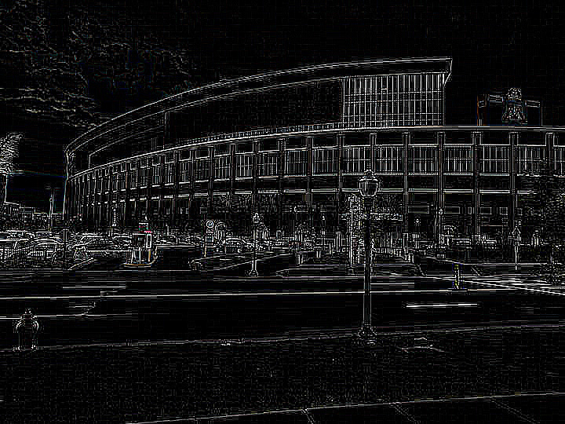
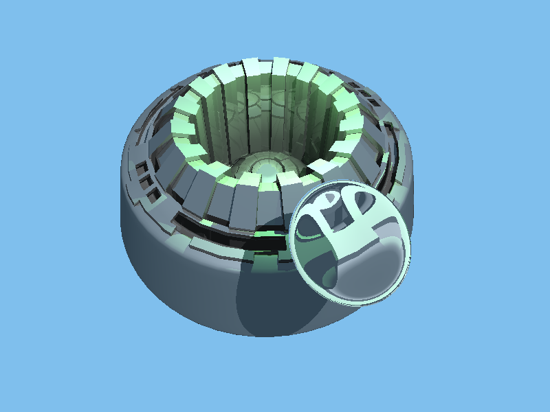
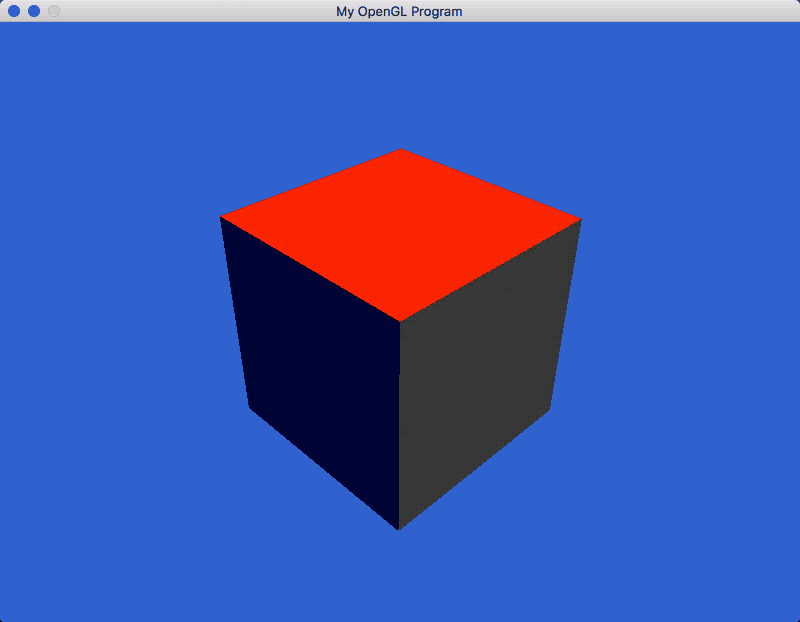
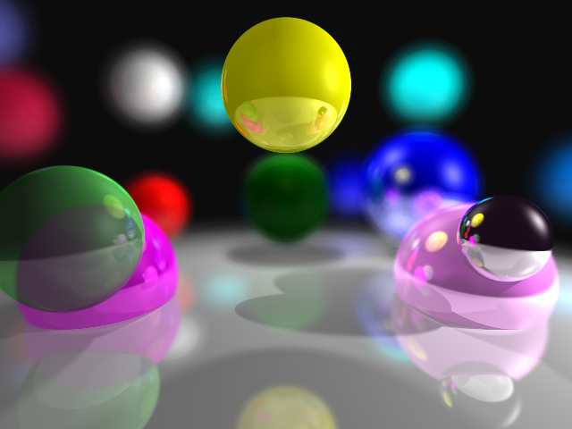

# CSCI 5607 - Fundamentals of Computer Graphics I

## Projects

### Assignment 0: Basic Model Transformation

### Assignment 1: Image Processing

### Assignment 2: Ray Caster

### Assignment 3: Ray Tracer

Source code was built off of `assignment2/`.

### Assignment 0.5: Simple OpenGL Demos

### Assignment 4: Maze Game
[YouTube link](https://youtu.be/jNYmxnUXYhw)

### Final Project: Distribution Ray Tracer

