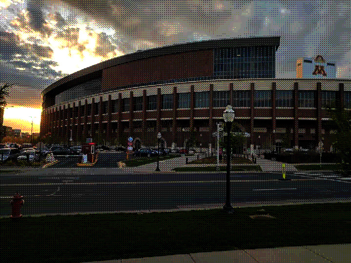

# Filters
### Original Image


### Noise
```
./image -input sample/tcf.jpg -noise 0.4 -output images/tcf-noise04.jpg
```


### Brightness
```
./image -input sample/tcf.jpg -brightness 1.8 -output images/tcf-brightness18.jpg
```


### Contrast
```
./image -input sample/tcf.jpg -contrast 0.3 -output images/tcf-contrast03.jpg
```


### Saturation
```
./image -input sample/tcf.jpg -saturation 1.5 -output images/tcf-saturation15.jpg
```


### Crop
```
./image -input sample/tcf.jpg -crop 100 50 300 200 -output images/tcf-crop_100_50_300_200.jpg.jpg
```


### Extract Channel
```
./image -input sample/tcf.jpg -extractChannel 0 -output images/tcf-extract_channel0.jpg
```


### Quantize
```
./image -input sample/tcf.jpg -quantize 2 -output images/tcf-quantize2.jpg
```


### Random Dither
```
./image -input sample/tcf.jpg -randomDither 1 -output images/tcf-quantize2.jpg
```


### Blur
```
./image -input sample/tcf.jpg -blur 11 -output images/tcf-blur11.jpg
```


### Sharpen
```
./image -input sample/tcf.jpg -sharpen 11 -output images/tcf-sharpen11.jpg
```


### Edge Detection
```
./image -input sample/tcf.jpg -edgeDetect -output images/tcf-edge_detect.jpg
```


### Ordered Dither
```
./image -input sample/tcf.jpg -orderedDither 4 -output images/tcf-ordered_dither4.jpg
```


### Ordered Dither
```
./image -input sample/tcf.jpg -FloydSteinbergDither 2 -output images/tcf-floyd_steinberg2.jpg
```


### Scale
```
./image -input sample/tcf.jpg -scale 2 2 -output images/tcf-scale_2_2_sampling_0.jpg
```


### Rotate
```
./image -input sample/tcf.jpg -rotate 60 -output images/tcf-rotate_60_sampling_0.jpg
```


### Fun
I implemented a swirl filter. It works just like the rotate filter, except each point gets rotated by a different angle.
```
./image -input sample/tcf.jpg -fun -output images/tcf-fun_sampling_0.jpg
```


# Sampling Methods
For each of the following images, I zoomed in on a portion to make the sampling easier to see.

### Point Sampling
```
./image -input sample/tcf.jpg -sampling 0 -scale 2 2 -output images/tcf-scale_2_2_sampling_0.jpg
```


### Bilinear Sampling
```
./image -input sample/tcf.jpg -sampling 1 -scale 2 2 -output images/tcf-scale_2_2_sampling_1.jpg
```


### Gaussian Sampling
```
./image -input sample/tcf.jpg -sampling 2 -scale 2 2 -output images/tcf-scale_2_2_sampling_2.jpg
```


# Experiences, Difficulties, Successes
One thing I had difficulty with was the various sampling methods. For me, it was hard to wrap my head around the source image being a continuous signal, more than just a set of discrete samples. I think going over more examples of this in 2D in class would have helped.

Getting convolution to work was also a bit of a challenge. Some of my difficulties had to do with the copy constructor for the `Image` class not working properly. I had to switch to the `memcpy` line to get it to work properly.

The single-pixel manipulations like brightness and saturation were very easy to implement, so I think I got just about all of those done in one day.

# Modified `image.cpp`
[image.cpp](image.cpp)


# Art Contest Submission


I accidentally stumbled upon this image while I was testing Gaussian sampling. This was the result of not scaling the RGB values correctly, which made all the crazy colors. I thought I'd add to the effect with my swirl filter.

# Note
GCC 7 or any other compiler that supports C++17 is required.
