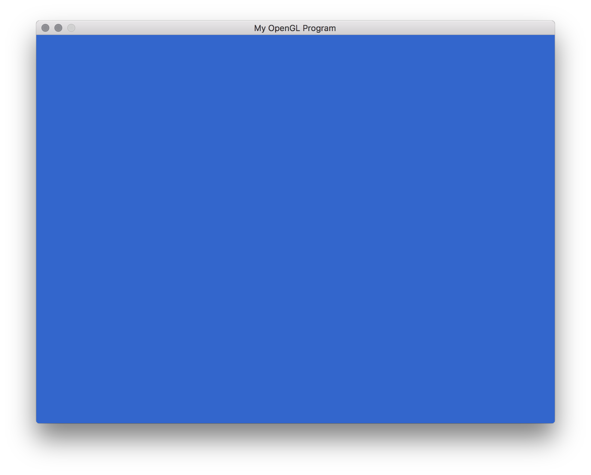
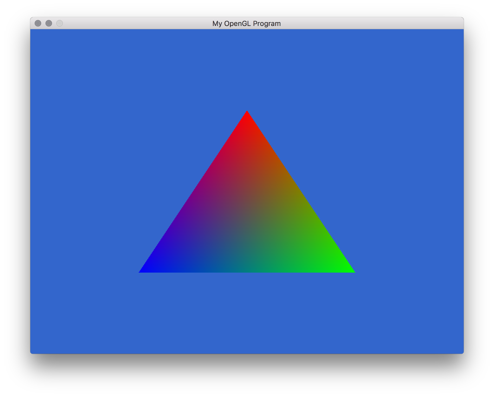
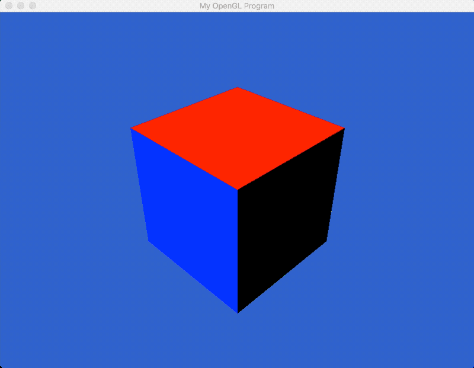
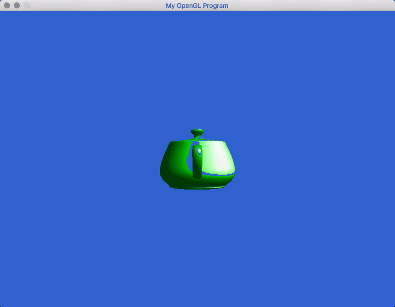
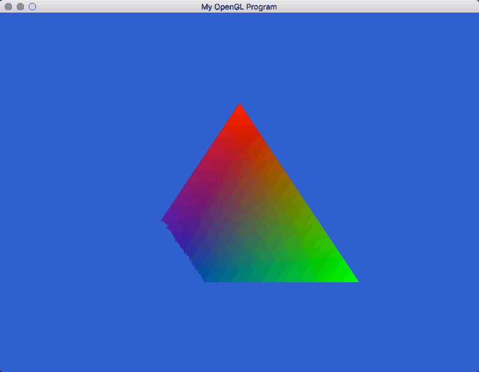
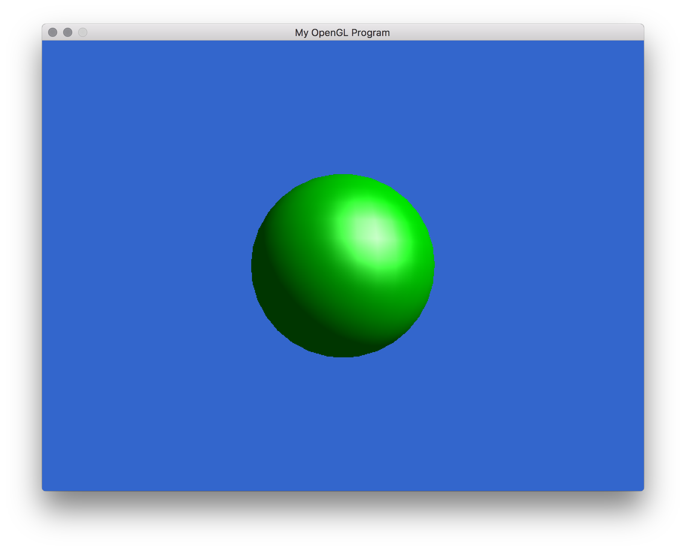
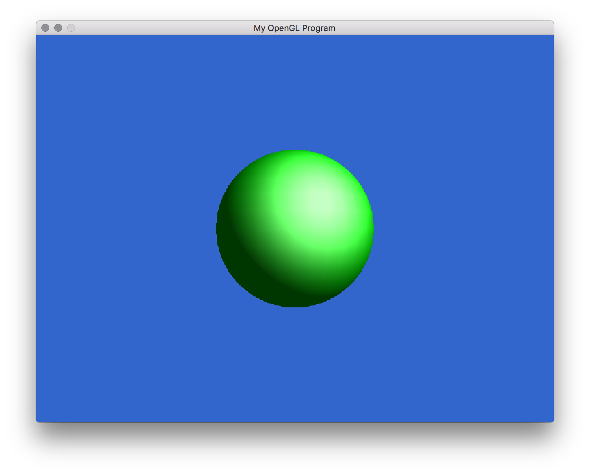

# Assignment 1/2
### by Jon Huhn (huhnx025)

## Demos In Action

### Blank Screen

### Triangle

### Cube3D

### CubeLit1VBO

Note: The rest of these GIFs look a little off. This was a result of the GIF rendering process and not OpenGL. They look fine when actually run.

### ModelLoad

## User Interaction

### Color-Changing Triangle
I implemented a function that would rotate the colors of the triangle and still interpolate between them when the spacebar was pressed.

### Translation and Rotation
Arrow keys translate the model and the WASD keys will rotate the model.

## Lighting Models

### Phong

### Blinn-Phong

