# CSCI 5607 Assignment 2 - Ray Casting

## Putting a Circle on the Screen
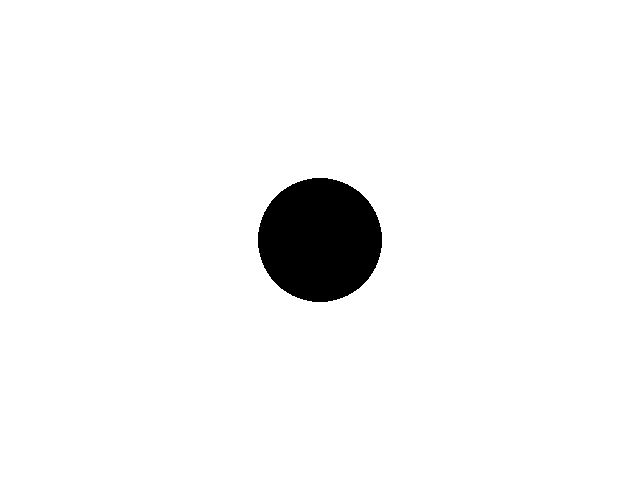

[Scene file](images/assignment2/01.scn)

## Multiple Circles with Distortion and Colors
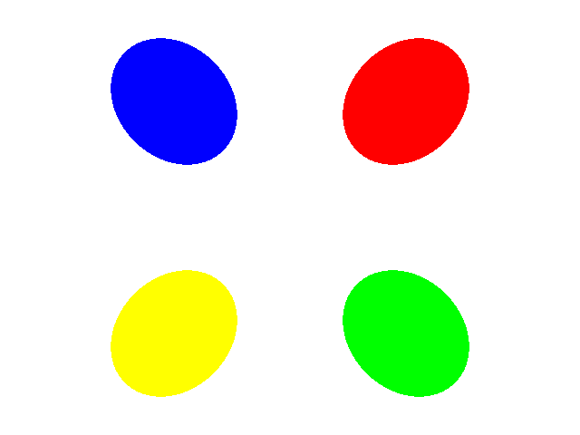

[Scene file](images/assignment2/03.scn)

## Diffuse Shading with One Sphere and One Point Light
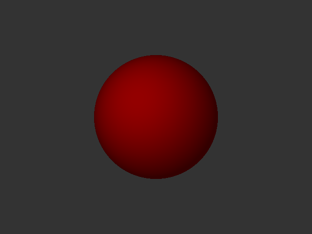

[Scene file](images/assignment2/04.scn)

## Phong Lighting with One Point Light
Exponent = 8

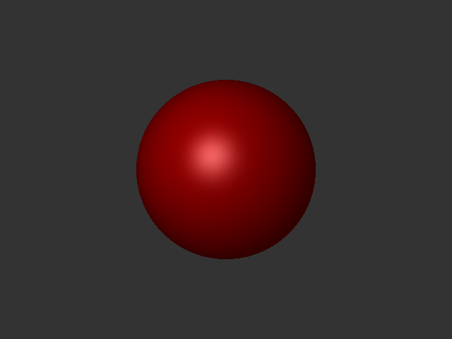

[Scene file](images/assignment2/05.1.scn)

Exponent = 16

[Scene file](images/assignment2/05.2.scn)

Exponent = 32

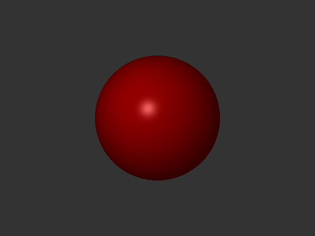

[Scene file](images/assignment2/05.scn)

Exponent = 64

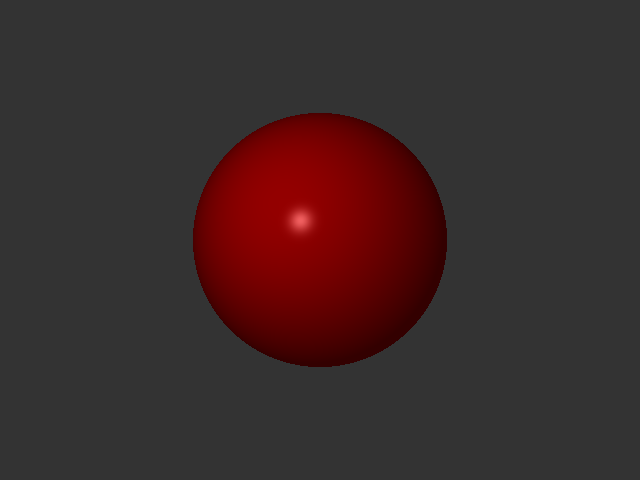

[Scene file](images/assignment2/05.3.scn)

## Multiple Point Lights
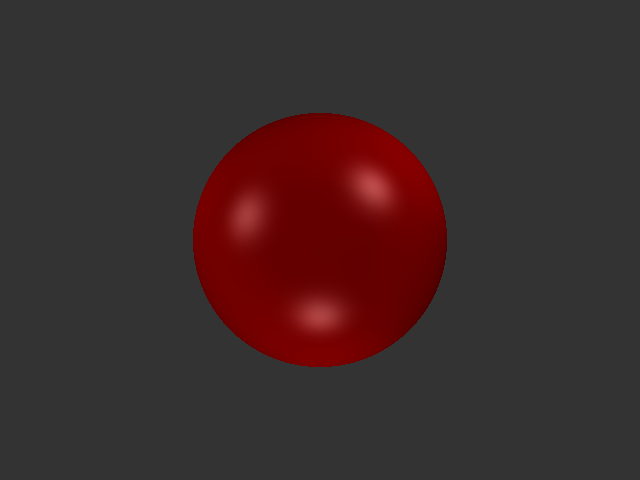

[Scene file](images/assignment2/06.scn)

## Shadows
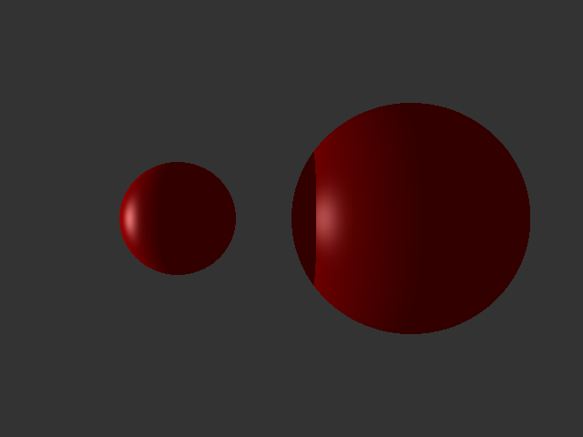

[Scene file](images/assignment2/07.scn)

## Sample Images
For these, I don't think my lighting model quite matches up with the sample images. I also didn't implement reflection and refraction, so that doesn't show up in the images my ray tracer generates.

#### Spheres1
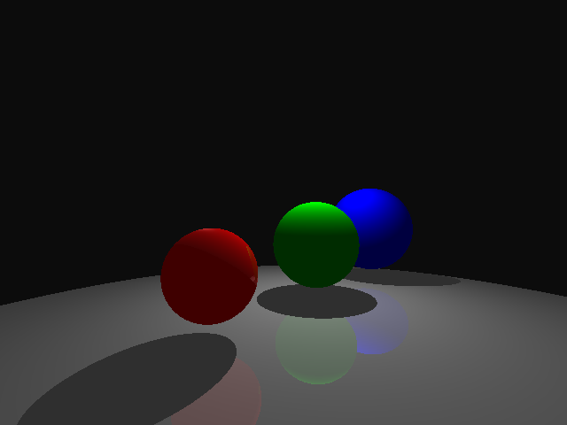

#### Spheres2
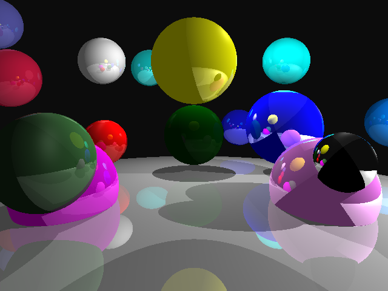

#### Bear
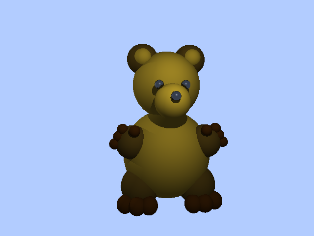

## My Implementation
Most of the functionality of my ray tracer is captured in a Scene class that contains all of the information from the scene file, including camera settings, a list of shapes, and a list of lights. All of the sphere-specific intersection details are kept in a Sphere class, which inherits from a Shape class. All of the math is supported by Vector and Ray classes that I designed. I use the Image and Pixel classes from Assignment 1 to handle writing out the files.

## Issues
I ran into quite a few issues with perspective. My camera would distort spheres a lot more than it should have. That was a result of assuming that u and v always pointed in the positive x and y directions when I generated rays through the canvas. Accounting for the up vector and adjusting the vector accordingly fixed that issue.

I also ran into an issue with what looked like shadow acne, but only happened around the specular highlight. I realized it was an issue with the t-value I was returning for an intersection with the sphere.

## Extra Credit Tasks
- BMP, PNG, and JPG output
- Shadows
- Multiple light sources
