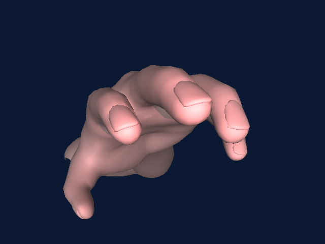
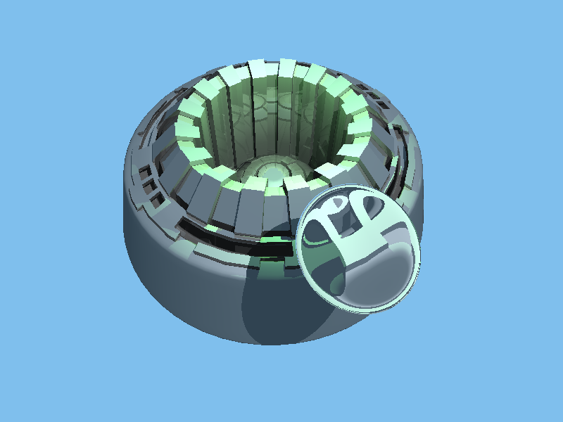

# CSCI 5607 - Assignment 3 - Ray Tracer
## Jon Huhn (huhnx025)

## Output Images

## Code
A link to my source code can be found [here](https://github.umn.edu/huhnx025/csci5607-assignment2/archive/v2.0.zip). I compiled this with g++ 7.1.

## Implementation
Most of the functionality of my ray tracer is captured in a Scene class that contains all of the information from the scene file, including camera settings, a list of shapes, and a list of lights. All of the sphere-specific intersection details are kept in a Sphere class, which inherits from a Shape class. Likewise, Triangle and NormalTriangle classes contain specific details for those primitives. All of the math is supported by Vector and Ray classes that I designed. I use the Image and Pixel classes from Assignment 1 to handle writing out the files.

## Problems
I ran into a number of problems with this assignment. One of the stranger issues I had dealt with how I was capping the recursion depth. I was keeping track of the current depth with a member variable of my Scene class, which was essentially a global variable. For whatever reason, that was causing strange side effects in my EvaluateRayTree method. Passing in the current depth as an argument instead fixed that problem.

## Extra Credit
### BVH
I implemented a bounding volume hierarchy to accelerate my ray tracer. The volumes I used are axis-aligned bounding boxes.  The tree is a binary tree the lowest BVH nodes containing only one primitive shape. Here is a table summarizing the performance benefits on a few scenes:

scene|without BVH|with BVH
-|-|-
spheres1|0.651s|0.914s
spheres2|1.842s|1.583s
dragon|19m02.56s|9.652s
gear|12m46.23s|22.392s

These tests were run on my 2013 MacBook Pro with a 2.4GHz Intel Core i5.

Interestingly, the spheres1 scene is slower with the BVH. Since that scene only has 4 spheres, it is more efficient to brute force check if a ray hits every sphere rather than build up a hierarchy. A BVH is simply overkill for simple scenes.

### Parallelization
I also used OpenMP to parallelize my ray tracer. I parallelized the loop where I iterate over each pixel in the image. Here is a table summarizing the performance improvements.

##### My MacBook Pro (4 cores)
scene|with OpenMP|without OpenMP
-|-|-
gear|22.392s|38.227s
dragon|9.652s|21.222s

##### CSE Labs Machine (Keller 4-250, 8 cores)
scene|with OpenMP|without OpenMP
-|-|-
gear|8.884s|22.606s
dragon|3.635s|12.878s
