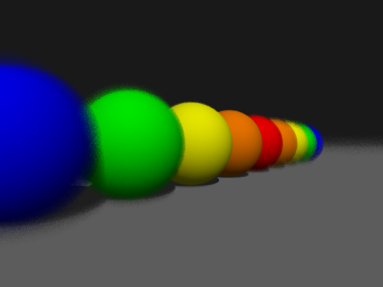

# CSCI 5607 - Assignment 5
## Final Project Check-in
### By Jon Huhn (huhnx025)

### Project Description
I am working alone on my final project. I am planning to implement a variety of features of a distributed ray tracer including depth of field and motion blur. I would also like to utilize these features to simulate different physical camera lenses and show the differences between them. I think it would be cool to produce some simple animations to show off these effects too.

### Progress Description
So far, I have implemented basic depth of field in my ray tracer by adding a new parameter to the scene file to control the focal distance and camera aperture. I have also created a very basic animation of spheres using a python script to generate scene files for each frame. I am a little worried about putting these two things together though. Since a decent blur effect for depth of field requires at least about 30 samples per pixel, rendering each frame of even a short animation would take a pretty long time. I might have to focus on creating good still images first and then maybe only make one or two videos with the effects.

### Images of Progress

Depth of field with an aperture of 0.8, 150 samples per pixel.

Same as above with 32 samples per pixel.
