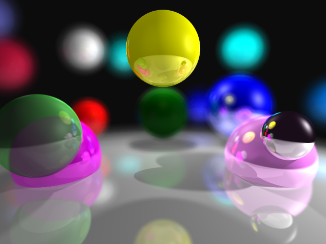

# CSCI 5607 - Final Project
### By Jon Huhn (huhnx025)

## Progress Description & Overview
<!-- Describe the overall goal of your project.  What were you aiming to
accomplish and how far along have you come.  What were the main obstacles you
encountered along the way. This section should be at least a paragraph. -->
I started out looking to implement a set of physical camera lenses in my ray tracer. After I made some progress, I pivoted toward implementing various features of a distributed ray tracer. So far, I've implemented supersampling, area lights with soft shadows, motion blur, and depth of field.

The biggest challenge I had along the way was finding a good way of fitting each of these features into my existing ray tracer. None of these features can be added onto the beginning or end of my ray tracing implementation, so they had to be carefully inserted into my implementation without breaking anything else.

I also struggled with finding an adequate sampling method for depth of field and soft shadows. I tried using random points, but the images came out too grainy. I switched to a method of essentially overlaying many images on top of each other which created a smoother effect.

Another unique challenge I didn't initially think about was how my BVH would work with motion blur, which involves moving objects. To solve this, I made the lowest-level bounding boxes that contain only one sphere to contain the sphere at its beginning and ending point. This works because I only implemented linear motion blur.

## Connection to Our Class
<!-- In what ways did your project demonstrate various aspects of computer
graphics we have discussed in this class. E.g., Time-based animation, Rendering
Pipeline, Image Sampling and Reconstruction, Lighting Models, Global & Local
Illumination, Perceptual basis for graphics, Shading Languages, etc. This section
should be at least a paragraph. -->
My project is a direct continuation of Assignments 2 and 3 to build a basic ray tracer. My extensions had more to do with adding to the ray tracing algorithm than creating new visual effects. These modifications create features given by more physically accurate cameras. There are some elements of sampling present in these features. To create depth of field, the area making up the camera's aperture must be sampled enough for smooth and accurate blurring. The same concepts are needed when sampling the surface of an area light source to create soft shadows. I also implemented a method of anti-aliasing by supersampling. I enhanced the lighting model of my ray tracer with area lights that cast soft shadows.

## Key Features & Images
<!-- Describe the various key features of your final working system. Show several images of your project working. Highlight the various features with different images. -->

### Supersampling
I implemented jittered supersampling, which takes a number of random samples through each pixel and averages them together to create an overall smoother image with less aliasing.

##### Scene File Parameters

n is the number of samples per pixel

```
supersample n
```

##### Example Images


No supersampling, 1 sample per pixel


4 samples per pixel


150 samples per pixel

### Soft Shadows
I also implemented spherical area lights that cast soft shadows. Light doesn't originate from an infinitely small point in reality, so some parts of shadows can still be partially lit by the light source, leading to a smooth gradient on the edges of shadows. To create this effect in ray tracing, instead of only casting one shadow ray, cast many shadow rays to different points on the light source, and average their effects to set the shadow color of the final pixel.

##### Scene File Parameters

Lights are created as spheres with an emissive material component.
I added 3 emissive components to the end of each material.

```
material 1 0 0 1 0 0 0 0 0 16 0 0 0 1 100 100 100
sphere 0 10 4 0
```

n is the number of shadow ray samples.

```
shadow_samples n
```

##### Example Images


Small area light


Medium area light


Large area light

### Depth of Field
My basic ray tracer from Assignment 3 implemented a pinhole camera, where every object is in perfect focus. I implemented depth of field by simulating a lens camera with an aperture. To get the effect, instead of only casting rays from exactly the camera point, cast many rays from a circular area around the camera at a maximum distance of the aperture value onto the focal plane. This gives the effect of images on the image plane being rendered sharp, but images some distance from it are blurred. The farther images are from the focal plane, the blurrier they appear. A wider aperture also leads to blurrier overall images, since a wider area is sampled for camera rays.

##### Scene File Parameters

a is the radius of the aperture, measured in world coordinates.

```
aperture a
```

f is the distance from the camera to the focal plane.

```
focal_plane f
```

n is the number of samples to take for depth of field effects.

```
dof_samples n
```

##### Example Images

All of the images below were made with 150 samples per pixel.


Near focus


Mid focus


Far focus


Narrow aperture


Medium aperture


Wide aperture

### Motion Blur

The last feature I implemented was motion blur. Instead of sampling over area, like for the other effects, motion blur involves sampling over time. This requires each ray to have a time value associated with it, so it knows where each object is at any given time. Each pixel is sampled over every time interval, and the average color is the color of the final pixel. This has the same effect as drawing many faint objects on top of each other, slightly offset from each other.

I only implemented linear motion blur, where an offset from the objects current position is given, and all points in between are linearly interpolated.

##### Scene File Parameters
Motion blur works just like materials in the scene file. Each object has some blur associated with it (which defaults to (0, 0, 0)) and once some blur is defined, it carries through to all other objects until some new blur is defined. x, y, and z represent an offset from the objects defined position.

```
motion_blur x y z
```

n is the number of intermediate points to average together.

```
blur_samples n
```

##### Example Images


### Non-Random Sampling
To implement soft shadows and depth of field, I did not use random sampling. Instead, since those features involve sampling a circular area, I used a slightly different approach, since random sampling made pretty grainy images. Instead, I used two different functions to evenly sample over different angles and magnitudes offset from the original point. This led to much smoother images without any grainyness. Here is a code segment that implements it:

```C++
double theta = (2 * dof_samples / 8.) * M_PI * t;
double mag = aperture * std::sin(dof_samples / 1.7 * M_PI * t);
```

where `t` varies between 0 and 1. These parameters were tweaked by hand. They are by no means scientifically the best values.


### Highlights


Spheres1 with rendered area light and soft shadows.


Test scene with motion blurred spheres with reflections.



Spheres2 with depth of field.


Dragon, 32 samples per pixel. (~2.5 minutes)


Extra spooky arm.

## Future Work
<!-- In what ways could your project be extended going forward? -->
One main feature missing from my distributed ray tracer is rendering glossy reflections. Other than that, the features I implemented were not the most robust. For example, area lights and some other features only work with spheres. They could be generalized to work with triangles or any other shape too. One could devise more clever ways of sampling for smoother effects, especially for depth of field and soft shadows. There is also room to improve performance by better parallelizing the sampling loops. One could also use a better anti-aliasing method, like adaptive supersampling. My implementation also doesn't allow combining many of these features, since combining them would multiple the number of samples needed for each pixel in the final image. Motion blur could also be enhanced by defining curved paths or nonuniform motion, like accelerating objects.